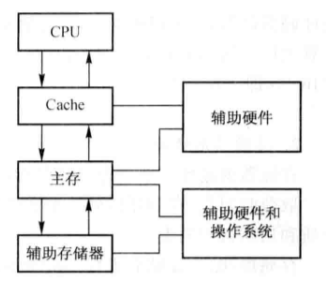

# 第五章 存储体系

## 5.1 存储体系概论

### 5.1.1 存储器的分类

#### 按存储介质分类

| 名称         | 常见的器件                          | 常用性 |
| ------------ | ----------------------------------- | ------ |
| 半导体存储器 | 双极性和 MOS 型半导体继承电路存储器 | 常用   |
| 磁存储器     | 磁芯、磁膜、磁盘存储器等            | 常用   |
| 光存储器     | 光盘                                | 常用   |
| 纸带存储器   | 暂无                                | 不常用 |

#### 按存取方式分类

1. **RAM** 随机读写存储器 （通过指令可以随机地、按地址地对各个存储单元访问，断电后信息不能保存，如主存储器）
2. **ROM** 只读存储器（断电后仍能保存信息）
3. CAM 相联存储器（访问的时候是通过它的部分内容而不是地址进行检索）
4. SAS 顺序存储器（存取时间和存储单元的物理位置有关，如**磁带**）
5. DAS 直接存取存储器（存取时间和存储单元的物理位置有关，根据地址编码的部分信息找到信息的所在范围，再进行顺序检索，如**磁盘**、**磁鼓存储器**，能长久保存信息）

### 5.1.2 存储器的层次结构

	

约上层越快

Cache 为高速缓存

存储系统的层次结构主要有两个，一个是<u>高速缓冲存储器和主存层次</u>，另一个是<u>主存和辅存层次</u>

#### 高速缓冲存储器和主存层次

主要解决 CPU 和主存速度不匹配的问题

解决方法：1.将主存储器划分为若干个模块，采用多模块交叉存储技术，

​                 2.在 CPU 和主存之间增加高速缓冲存储器

#### 主存和辅存层次

主要解决存储系统的容量问题

采用虚拟存储技术，把常用的、容量较小的信息放在速度块的主存中，其余的放在辅存里，由辅助硬件和操作系统调度

#### 工作原理

1. CPU 先访问 Cache，如果 Cache 中没有所需内容，则通过辅助硬件到主存中找
2. 如果主存中没有，则通过辅助硬件或软件到赋存中找
3. 把找到的数据放入相应的存储器中

## 5.2 主存储器

### 5.2.1 主存储器的性能指标

性能指标主要有：存储容量、速度、价格

#### 存储容量

若干<u>存储位元</u>（存放了一位二进制信息）组成一个<u>存储单元</u>

存储单元有编号，即<u>地址</u>，相邻存储单元的地址是连续的，是**最小的可编址单元**

存储器中存储单元的<u>位数</u>都是相同的

8 个二级制位为一个**字节**，若干个字节再组合成**字**，一个字所包含的二进制位数称为**字长**

**存储容量**指的是所能容纳的二进制信息的总量，通常用<u>存储单元数</u> * <u>每个单元的位数</u>来表示，如：$存储容量=存储字数（存储单元数）\times字长$

常用的容量单位为 KB(210 B)、MB(220 B)、GB(230 B)

存储器地址码的<u>位数</u>决定了主存可**直接寻址**的最大空间。例如：存储器有 n 位地址码，经地址译码器译码后，可以访问 2n 个存储单元。因此，可以根据存储器提供的地址线和数据线的数目计算容量，例如：地址线12，数据线16，则容量为 $2^{12}\times16$，即 $4K\times16$ 位