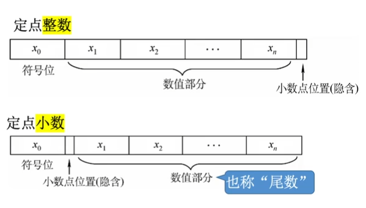

# 第三章

## 3.1 数值数据的表示

### 3.1.1 十进制数的编码

#### 格雷码

##### 异或运算法

- 首先写出 n 位的二进制编码
- 然后在最高位前面加 0，变成 n + 1 位
- 最后对每个码字相邻两位做异或运算(相异得 1，相同得 0)
- 比如：1100 --> 1010

#### 余三码

余三码就是对应的 8421 码加上 0011 构成的

### 3.1.2 定点数的表示

#### 有符号数的定点表示

- 可以用原码、反码、补码三种方式来表示定点整数和定点小数
- 还可以用移码表示定点整数
- 一般的机器字长是 8 位

	

##### 原码
###### 原码定点整数

- 正数的符号位为 0，负数的符号位为 1 ；数值部分直接按照二进制填充，高位凑 0  

	

###### 原码定点小数

- 正数的符号位为 0，负数的符号位为 1；小数点在符号位的后面，低位凑 0      

##### 反码

- 若符号位为 0，则反码与原码全部相同
- 若符号位为 1，则数值为全部取反（符号位不变）
- 小数和整数都是这样的规则
- 真值 0 有 +0 和 -0 两种形式，[+0]反  =  00000000；[-0]反  = 11111111
- 反码只是原码转变为补码的一个**中间状态**，实际上没什么用

##### 补码

- 正数的补码 = 原码；负数的补码 = 反码末位 + 1（要考虑进位）
- 补码的真值 0 只有一种表现形式 [+0]补  =  [-0]补 = 00000000
- 由 [x]补 快速求 [-x]补 的方法：全部位取反，末位再加一

##### 移码

- 补码的基础上将符号位取反
- 移码只能用来表示整数
- 移码表示的整数很方便对比大小 

### 3.1.3 浮点数的表示

	

- 阶码反映浮点数的表示范围以及小数点的实际位置；阶码是常用补码或移码表示的定点整数
- 尾数的数值部分的位数反应浮点数的精度；尾数是常用原码或补码表示的定点小数
- 例如：对于阶码和尾数均用补码表示的浮点数 a：**`0,01;1.1001`**

#### 浮点数尾数的规格化

- 规定**尾数的最高<u>数值位</u>必须是一个有效值** (即最高位不能为 0 )
- 采用原码表示的尾数，最高数值位为1；采用补码的，最高数值位为0
- 左规：当浮点数运算的结果为非规格化时要进行规格化处理，将尾数算数左移一位，阶码减一
- 右规：当浮点数运算的结果尾数出现溢出（双符号位为 01 或 10 时），将尾数算数右移一位，阶码加一
- 采用双符号位，当溢出发生时，可以挽救；更高的符号位是正确的符号位
- 尾数的补码算数左移，低位补 0；算数右移，负数的话高位补 1，正数高位补 0
#### 浮点数的表示范围
- 碰到正下溢和负下溢时，当做机器 0；碰到正上溢和负上溢（机器码尾数不够表示数值）时，抛出异常

### 3.1.3 校验码

#### 基本概念

- 校验码是一种具有发现某些错误或自动改正错位能力的一种数据编码方法
- 由若干位代码组成的一个字叫做**码字**
- 各个合法字码间的最小距离为**码距**（就是有多少个位是不一样的）
- 当码距 d 为 1 的时候，无纠错能力；d = 2 时，有检错能力；d >= 时，若设计合理，可能具有检错、纠错能力

#### 奇偶校验码

	

- 奇校验码：整个校验码中的 1 的个数为奇数
- 偶校验码：整个校验码中的 1 的个数为偶数
- 例如： 奇校验 1001101 有 4 个 1，所以在校验位再添一个 1，得到奇数个的 1 的 11001101
- 发生奇数个位的跳变的时候，奇偶校验码可以检错；偶数个位的跳变不行

#### 海明校验码

- 设计思路：对有效信息位分组进行偶校验，得到多个校验位

  

- 检验位 pi 放在号为 2i-1 的位置上（即放在 1，2，4，8.....的位置上，如下图所示）

  	

- 