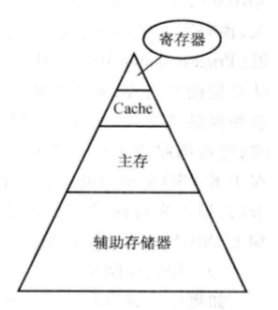

# 第五章 存储体系

[TOC]

## 5.1 存储体系概论

### 5.1.1 存储器的分类

#### 按存储介质分类

| 名称         | 常见的器件                          | 常用性 |
| ------------ | ----------------------------------- | ------ |
| 半导体存储器 | 双极性和 MOS 型半导体继承电路存储器 | 常用   |
| 磁存储器     | 磁芯、磁膜、磁盘存储器等            | 常用   |
| 光存储器     | 光盘                                | 常用   |
| 纸带存储器   | 暂无                                | 不常用 |

#### 按存取方式分类

1. **RAM** 随机读写存储器 （通过指令可以随机地、按地址地对各个存储单元访问，断电后信息不能保存，如主存储器）
2. **ROM** 只读存储器（断电后仍能保存信息）
3. CAM 相联存储器（访问的时候是通过它的部分内容而不是地址进行检索）
4. SAS 顺序存储器（存取时间和存储单元的物理位置有关，如**磁带**）
5. DAS 直接存取存储器（存取时间和存储单元的物理位置有关，根据地址编码的部分信息找到信息的所在范围，再进行顺序检索，如**磁盘**、**磁鼓存储器**，能长久保存信息）

### 5.1.2 存储器的层次结构

	

约上层越快

Cache 为高速缓存

存储系统的层次结构主要有两个，一个是<u>高速缓冲存储器和主存层次</u>，另一个是<u>主存和辅存层次</u>

#### 高速缓冲存储器和主存层次

主要解决 CPU 和主存速度不匹配的问题

解决方法：1.将主存储器划分为若干个模块，采用多模块交叉存储技术，

​                 2.在 CPU 和主存之间增加高速缓冲存储器

#### 主存和辅存层次

主要解决存储系统的容量问题

采用虚拟存储技术，把常用的、容量较小的信息放在速度块的主存中，其余的放在辅存里，由辅助硬件和操作系统调度

#### 工作原理

1. CPU 先访问 Cache，如果 Cache 中没有所需内容，则通过辅助硬件到主存中找
2. 如果主存中没有，则通过辅助硬件或软件到赋存中找
3. 把找到的数据放入相应的存储器中

## 5.2 主存储器

### 5.2.1 主存储器的性能指标

性能指标主要有：存储容量、速度、价格

#### 存储容量

若干<u>存储位元</u>（存放了一位二进制信息）组成一个<u>存储单元</u>

存储单元有编号，即<u>地址</u>，相邻存储单元的地址是连续的，是**最小的可编址单元**

存储器中存储单元的<u>位数</u>都是相同的

8 个二级制位为一个**字节**，若干个字节再组合成**字**，一个字所包含的二进制位数称为**字长**

**存储容量**指的是所能容纳的二进制信息的总量，通常用<u>存储单元数</u> * <u>每个单元的位数</u>来表示，如：$存储容量=存储字数（存储单元数）\times字长$

常用的容量单位为 KB(210 B)、MB(220 B)、GB(230 B)

存储器地址码的<u>位数</u>决定了主存可**直接寻址**的最大空间。例如：存储器有 n 位地址码，经地址译码器译码后，可以访问 2n 个存储单元。因此，可以根据存储器提供的地址线和数据线的数目计算容量，例如：地址线12，数据线16，则容量为 $2^{12}\times16$，即 $4K\times16$ 位

#### 存储器的速度

取数时间 tA；存储周期 tC

$t_A<t_c$

### 5.2.2 主存储器的工作原理

### 5.2.3 **RAM** 随机读写存储器

#### 半导体存储芯片的基本结构

	

1. 存储矩阵：由大量相同的**位存储单元**阵列构成
2. 译码驱动：将来自地址总线的**地址信号**翻译成应存储单元的**选通信号**，该信号在读写电路的配合下完成对被选中单元的读/写操作
3. 读写电路：包括读出放大器和写入电路，用来完成读/写操作
4. 读/写控制线：决定芯片进行读/写操作
5. 片选线：确定哪个存储芯片被选中，可用于容量扩容
6. 地址线：是单向输入的，其位数与存储字的个数有关
7. 数据线：是双向的，其位数与读出或写入的数据位数有关
8. 数据线数和地址线数共同反映存储芯片容量的大小

#### 半导体随机存取存储器

| 特点 \ 类型 |             SRAM 静态随机存储器              |               DRAM 动态随机存储器                |
| :---------: | :------------------------------------------: | :----------------------------------------------: |
|  存储信息   |        触发器（双稳态，稳定存储0/1）         |                  电容（充放电）                  |
| 破坏性读出  | 非（读：查看触发器状态；写：改变触发器状态） | 是（读：连接电容，检测电流变化；写：给电容放电） |
|  需要刷新   |         不要（能保持两种稳定的状态）         |        需要（电容上的电荷只能维持  2ms）         |
| 送行列地址  |                    同时送                    |       分两次送（地址线复用，线数减少一半）       |
|  运行速度   |                      快                      |                        慢                        |
|   集成度    |            低（6 个逻辑元件构成）            |            高（1 或者 3 个逻辑元件）             |
|   发热量    |                      大                      |                        小                        |
|  存储成本   |                      高                      |                        低                        |

##### 特性

1. 都以电信号的形式存储 0/1，断电就丢失信息，为易失性存储器
2. SRAM 常用作 Cache，DRAM 常用作主存

后期结合发展为 <u>SDRAM 同步动态随机存储器</u>

##### DRAM 的刷新

1. 刷新周期为 2ms

2. 只传**行地址**，以行为单位，每次刷新一行存储单元 （DRAM 的行、列地址等长）

3. 由硬件支持，读出一行的信息后重新写入，占用 1 个读/写周期

4. **什么时候刷新？**

    假设 DRAM 内部结构排列成 128 ✖ 128 的形式，存储周期（读/写周期）为 0.5us，则一个刷新周期内有 2ms / 0.5us = 4000 个周期。<u>思路一，**分散刷新**</u>：每次读写玩就刷新一行 --> 系统的存储周期变为 1us，即前 0.5 us 用于正常读写，后 0.5 us 用于刷新某行。<u>思路二，**集中刷新**</u>：2ms 内集中安排时间全部刷新 --> 系统的存取周期还是 0.5us，留一段时间专门用于刷新，称为*访问“死区”*。<u>思路三，**异步刷新**</u>：2ms 内每行刷新 1 次即可 --> 2ms 内需要产生 128 次刷新请求，每隔 2ms / 128 =15.6us 一次，每 15.6us 内有 0.5 us 的死区

	

### 5.2.4 ROM 只读存储器

主要有

1. MROM 掩模式只读存储器

2. PROM 可编程只读存储器

3. EPROM 光擦除可编程只读存储器 和 E2PROM 电擦除可编程只读存储器

4. Flash Memory 闪速存储器

5. 固态硬盘

  

## 5.3 主存储器与 CPU 的连接

主存基本包括两个部分，即 ROM 和 RAM

### 5.3.1 存储器芯片介绍

SRAM：工作电压 VCC；接地端 GND；片选线 $\overline{CS}$；读写控制信号$\overline{WE}$ 

DRAM：在 SRAM 拥有的引脚的基础上加上

​              行地址选通信号 $\overline{RAS}$；列地址选通信号 $\overline{CAS}$

ROM：程序电压 VPP；无读写控制信号$\overline{WE}$WE

为了与主存连接，CPU 提供了<u>地址线</u>、<u>数据线</u>、<u>访存控制信号</u>$\overline{MREQ}$和<u>读/写控制信号</u> $R/\overline{W}$等

### 5.3.2 存储容量的扩展

#### 位扩展

8 个 8K × 1 位的存储芯片连在一起可以做成 1 个 8K × 8 位的存储芯片

#### 字扩展

线选法

译码片选法

##### 总结

|              线选法               |                 译码器片选法                  |
| :-------------------------------: | :-------------------------------------------: |
| n 条线 $\rightarrow$ n 个选片信号 | n 条线 $\rightarrow$ 2n 个选片信号 |
|             电路简单              |                   电路复杂                    |
|          地址空间不连续           |       地址空间可连续，可以增加逻辑设计        |

#### 字位同时扩展

### 5.3.3 例题

解：