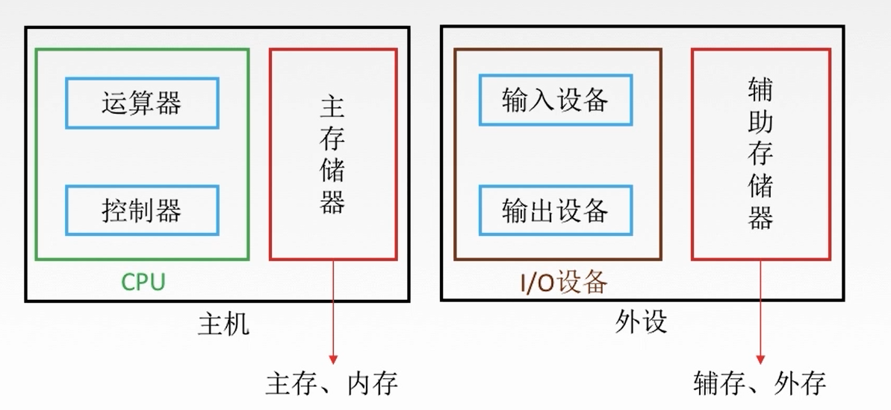

# 第五章 存储体系

## 5.1 存储器与CPU的协同工作

### 5.1.1 存储器的简单模型及寻址的概念

#### 主存储器

#### 寻址

### 5.1.2 主存与CPU的连接

### 5.1.3 双口RAM与多模块存储器

### 5.1.4 高速缓冲存储器

### 5.1.5 虚拟存储器

## 5.2 半导体存储器

### 5.2.1 存储芯片的基本结构

### 5.2.2 SRAM、DRAM的工作原理

### ROM的特点和基本类型

## 5.3 基本概念

### 5.3.1 分类

### 5.3.2 性能指标

## 5.1 层次结构

### 5.1.1 基本介绍

#### 冯·诺依曼计算机

“存储程序”：将指令以代码的形式事先输入到计算机的主存储器中，然后按其在存储器中的首地址执行程序的第一条指令，以后就按照程序的规定顺序执行其他指令

##### 特点

### 5.1.2 功能部件-存储器

