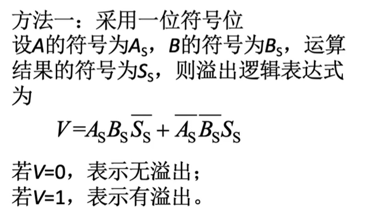
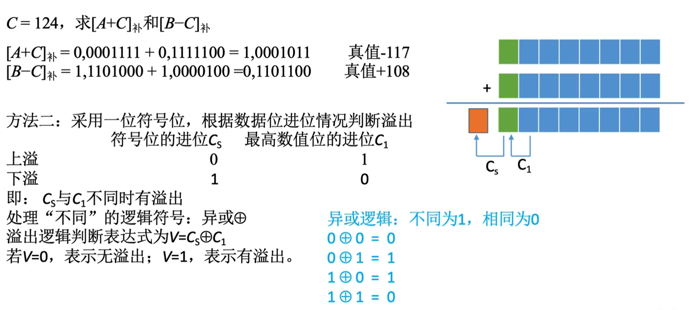
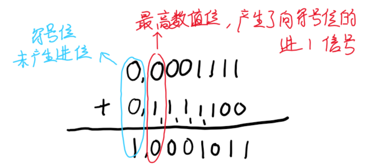
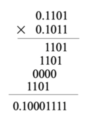
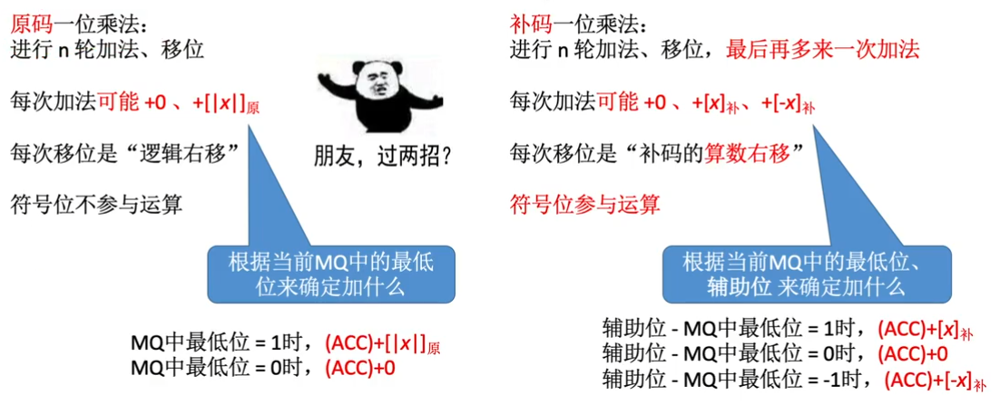
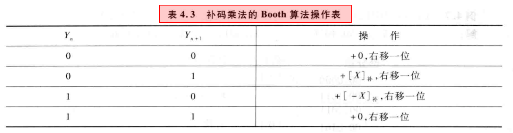
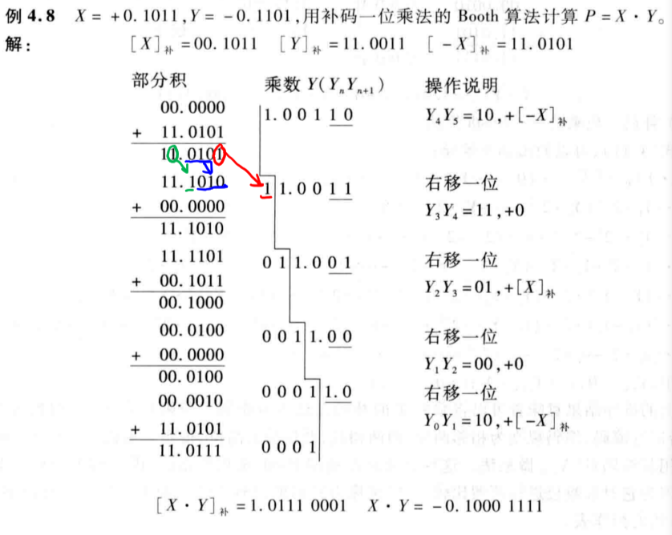

# 第四章

## 4.1 定点数的加减运算及实现

### 4.1.1 原码的加减法

#### 原码的加法运算

符号位不参与运算；只有数值位参与运算

1. 正 + 正：绝对值做加法，结果为正
2. 负 + 负：绝对值做加法，结果为负
3. 正 + 负：绝对值大的减绝对值小的，符号同绝对值大的数

#### 原码的减法运算

减数符号取反，转变为加法

### 4.1.2 补码的加减法

符号位也参与运算

### 4.1.3 溢出判断

1. <u>正 + 正</u> 可能会上溢，产生负数
2. <u>负 + 负</u> 可能会下溢，产生正数
3. 正 + 负 不可能会产生溢出

#### 溢出判断的机器表达式

##### 方法一

根据离散、数电的知识推出

	

##### 方法二

符号位的进位和最高数值位的进位如下：

	

##### 方法三

采用双符号位

	

### 4.1.4 机器数的移位运算

#### 逻辑移位

直接补 0

#### 算数移位

通过改变各个数码位和小数点的相对位置，从而改变各数码位的位权

##### 原码的算术移位

- 右移：高位补 0，低位舍弃；若舍弃的位 != 0，则会丢失精度
- 左移：低位补 0，高位舍弃；若舍弃的位 != 0，则会出现严重误差

##### 反码的算数移位

- 正数反码的移位运算与原码相同
- 负数的反码运算补位补的都是 **1** 

##### 补码的算数移位

- 正数补码的移位运算与原码相同
- 负数补码中，最右边的 1 及其右边同原码，最左边的 1 的左边同反码，所以是：**高位补 1，低位补 0**

## 4.2 定点数的乘法运算及实现

### 4.2.1 原码乘法及实现

#### 手算乘法

与十进制的乘法算法相同

	

#### 原码一位运算

- 符号位单独处理，符号位 = XS $\oplus$ YS 
- 数值位取绝对值进行乘法运算

##### 实现方法

- 先加法，再移位，重复 n 次

##### 举例

	

### 4.2.2 补码的乘法运算

#### 补码一位乘法

##### 校正法

补码一位运算与原码一位运算的区别如下

	

##### 实现方法

##### booth 算法

###### 运算规则

1. 被乘数 X 和乘数 Y 均以补码的形式参加运算

2. 部分积和被乘数 X 采用双符号位，乘数 X 采用单符号位

3. 初始的部分积为 0；运算前，再乘数 Y 的补码末位后添加一位附加位 Yn + 1，初始值为 0

4. 根据 Yn Yn + 1 的值，按照表格进行右移操作，遵循补码的移位规则

5. 累加 n + 1 次，右移 n 次

###### 实例

   

